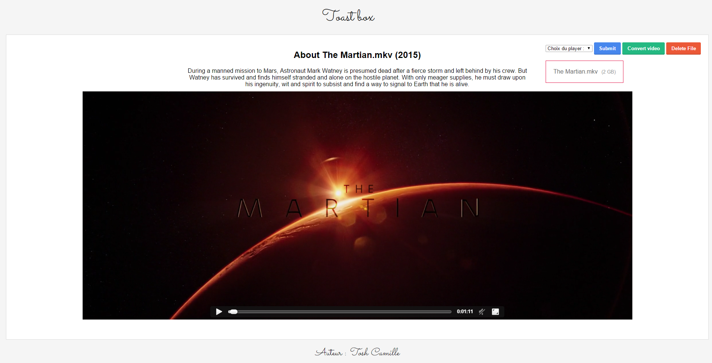

# ToastBox

ToastBox est un [Cakebox like](https://github.com/Cakebox/cakebox) écrit en PHP et utilisant l'API de IMDB. 

Chrome a bloqué les players comme Silverlight, VLC ou encore Divx en septembre 2015. Le HTML ne supporte pas tout les formats. Je ferai surement une conversion via FFMPEG.

# L'application 


## la page d'acceuil avec vos films/vidéos/séries


## la page de lecture vidéo




## Features

* Naviguer entre les fichiers du répertoire
* Lire les vidéos depuis son navigateur 
* Pouvoir télécharger le fichier
* Pouvoir supprimer le fichier
* Pouvoir convertir une vidéo au format mp4 (codec audio : AAC, codec vidéo : h264) à l'aide de FFMPEG 
* Avoir différentes informations sur les films / séries 

# Comment l'installer

## Nginx par [Billred](https://mondedie.fr/profile.php?id=3963) :

```
cd /var/www/
```

```
git clone https://github.com/CamTosh/ToastBox.git
```

```
chown -R www-data:www-data ToastBox/
```

Dans le fichier de configuration :

```
## début config ToastBox serveur ##

        location ^~ /ToastBox {
            root /var/www;
            include /etc/nginx/conf.d/php.conf;
            include /etc/nginx/conf.d/cache.conf;
            satisfy any;
            allow all;
        }

## fin config ToastBox serveur ##
```