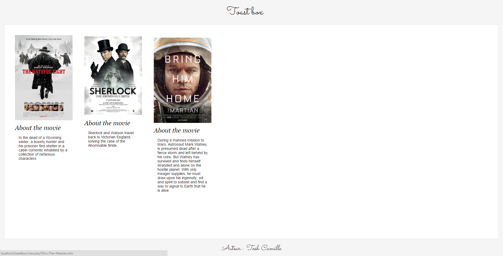
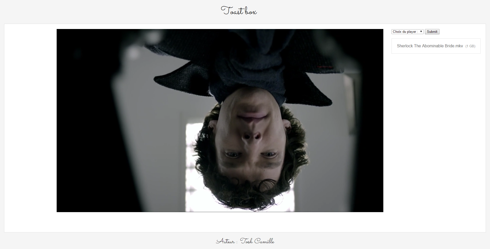
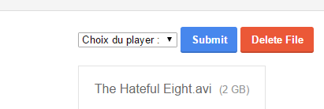

# ToastBox

ToastBox est un [Cakebox like](https://github.com/Cakebox/cakebox) écrit en PHP et utilisant l'API de IMDB. 

Il est gratuit pour un usage personnel (non commercial). Pour un usage à la revente / destiné à des fins commerciales merci de me contacter (twitter : @ToshCamille / mail : tochecamille[at]gmail[dot]com) pour fixer un tarif mensuel.

Chrome a bloqué les players comme Silverlight, VLC ou encore Divx en septembre 2015. Le HTML ne supporte pas tout les formats. Je ferai surement une conversion via FFMPEG.

# L'application 

## la page d'acceuil avec vos films/vidéos/séries

## la page de lecture vidéo

## Le choix du lecteur vidéo ainsi que les bouton de téléchargement et de suppression du fichier

## Features

* Naviguer entre les fichiers du répertoire
* Lire les vidéos depuis son navigateur 
* Pouvoir télécharger le fichier
* Pouvoir supprimer le fichier
* Pouvoir convertir une vidéo au format mp4 (codec audio : AAC, codec vidéo : h264) à l'aide de FFMPEG 
* Avoir différentes informations sur les films / séries 

# Comment l'installer

Il vous mettre le dossier dans votre serveur web. Vous pouvez utiliser la fonction de conversion des vidéos en installant FFMPEG.

Les chemins des dossiers des vidéos (vidéos et vidéos converties) peuvent être modifiés dans le inc/config.php.

ToastBox ne nécessite d'aucune base de données.